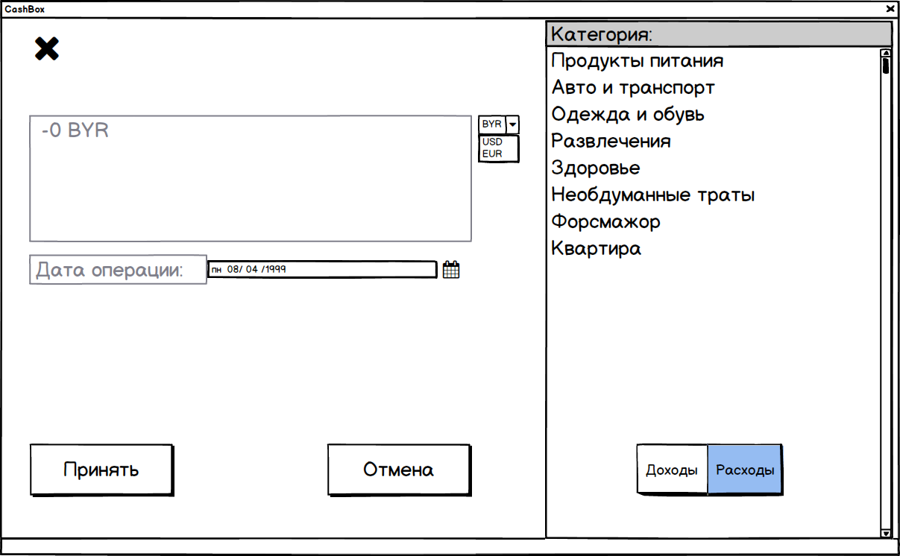

# Требования к проекту
---
# Содержание
1 [Введение](#intro)  
1.1 [Назначение](#appointment)   
1.2 [Возможности бизнеса](#business_opportunities)  
1.3 [Границы проекта](#project_boundary)  
2 [Требования пользователя](#user_requirements)  
2.1 [Программные интерфейсы](#software_interfaces)  
2.2 [Интерфейс пользователя](#user_interface)  
2.3 [Аудитория приложения](#user_specifications)  
3 [Системные требования](#system_requirements)  
3.1 [Функциональные требования](#functional_requirements)  
3.1.1 [Управление данными](#control)  
3.1.1.1 [Добавление операций](#add)  
3.1.1.2 [Удаление операций](#delete)   
3.1.1.3 [Изменение информации в операциях](#change)  
3.1.1.4 [Соотношение дат и операций](#date_to_operation)   
3.1.2 [Вход администрации](#drow_diagram)  
3.2 [Нефункциональные требования](#non-functional_requirements)  
3.2.1 [Атрибуты качества](#requirements_for_ease_of_use)  

<a name="intro"/>

# 1 Введение

<a name="appointment"/>

## 1.1 Назначение
В этом документе описаны функциональные и нефункциональные требования к десктоп приложению «CashBox». Данный проект содержит необходимую функциональность для расчета нынешнего финансового баланса пользователя, визуализации соотношения доходов/расходов.

<a name="business_opportunities"/>

## 1.2 Возможности бизнеса
Проблема финансовой грамотности стоит в приоритете у каждого человека, живущего в современном обществе, а это значит лишь то, спрос на услуги консультации в этом вопросе будут актуальны до тех пор, пока у человека есть собственность, которой надо распряжаться.

<a name="project_boundary"/>

## 1.3 Границы проекта
Сайт позволит формировать базу данных расходов и доходов пользователей, расчет дальнейшего баланаса и его визуализацию.

<a name="user_requirements"/>

# 2 Пользовательские требования

<a name="software_interfaces"/>

## 2.1 Программные интерфейсы
Приложение разрабатывается на языке Python с использовнием базы данных SQLite и библиотек Tkinter, Matplotlib.

<a name="user_interface"/>

## 2.2 Интерфейс пользователя

- Стартовое окно

    

- Окно добавления операции

    

<a name="user_specifications"/>

## 2.3 Аудитория приложения
Аудиторию приложения может составить любой человек: ребенок, желающий грамотнее тратить свои карманные деньги, студент, копящий на машину мечты, и состоявшийся человек, не желающий тратить заработанные деньги опрометчиво.

 <a name="system_requirements"/>

# 3 Системные требования

<a name="functional_requirements"/>

## 3.1 Функциональные требования

 <a name="control"/>

### 3.1.1 Управление данными

<a name="add"/>

#### 3.1.1.1 Добавление операций
Пользователь имеет право добавлять финансовые операции.

<a name="delete"/>

#### 3.1.1.2 Удаление операций
Пользователь имеет право удалять гайды.

<a name="change"/>

#### 3.1.1.3 Изменение информации в операциях
Пользователь имеет право изменить информацию в уже созданной операции.

<a name="date_to_operation"/>

#### 3.1.1.4 Соотношение дат и операций
Привязывание операций к определенной дате, для дальнейшего использования в статистике.

<a name="drow_diagram"/>

### 3.1.2 Изображение диаграммы состояния баланса
Автоматическое построение диаграммы соотношения расходов и доходов.

<a name ="non-functional_requirements"/>

## 3.2 Нефункциональные требования

<a name="requirements_for_ease_of_use"/>

### 3.2.1 Атрибуты качества
1. Все элементы должны быть выдержаны в темных тонах, чтобы не перенапрягать зрение.
2. Все функциональные элементы пользовательского интерфейса имеют названия, описывающие действие, которое произойдет при выборе элемента.
3. Минимальное количество кнопок и максимальное количество функционала.
4. Максимально простое приложение позволяет увеличить такие важные показатели как надежность и простота в использовании.

<a name="4"/>

# 4 Аналоги

1. MoneyFlow является продвинутым инструментом для учета личных финансов. Оно имеет привлекательный минималистичный дизайн и позволяет вносить расходы, доходы и переводы между счетами в разных валютах.  
2. Money Lover — приложение для тех, кто хочет держать свои финансы под контролем. С его помощью можно следить за тратами, формировать бюджет и всегда быть в курсе того, сколько у вас имеется сбережений.  
